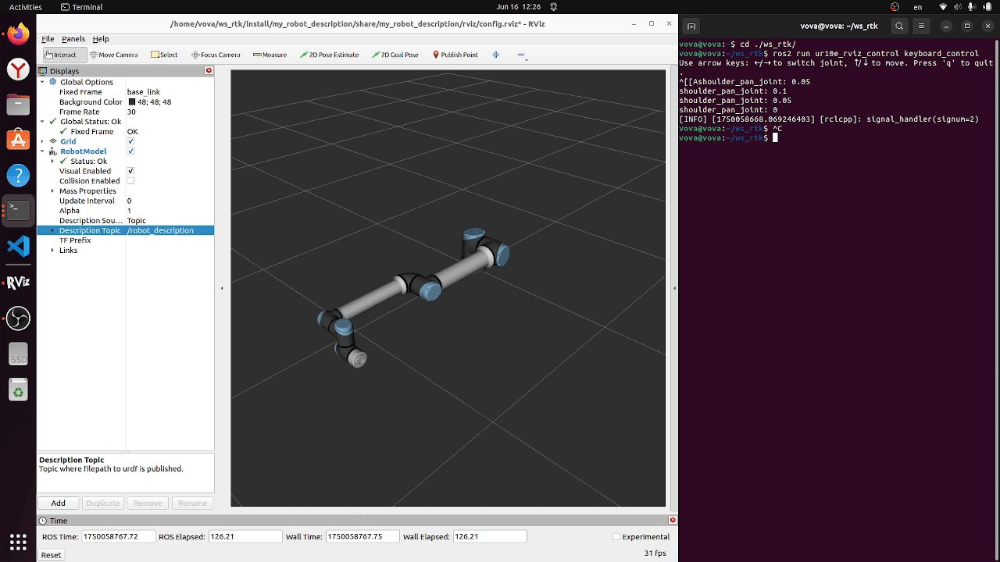

# Universal_Robots_ROS2_Controll_in_Rviz2_with_URDF


## 🎮 Keyboard Control for UR10e Manipulator in RViz2

This repository contains a ROS 2 (Humble) setup to control a UR10e robotic arm using keyboard input. It allows real-time manipulation of joints directly from the keyboard, visualized in RViz2.

## 🧩 Features

- Control UR10e joints via keyboard arrow keys
- Switch between joints using left/right keys
- Move selected joint using up/down keys
- Real-time joint state publishing
- Robot visualization in RViz2
- Based on standard ROS 2 packages (`robot_state_publisher`, `joint_state_publisher`, `rviz2`)

## 📁 Project Structure

ur10e_rviz_control/

├── launch/

│ └── ur10e_keyboard_control.launch.py

├── rviz/

│ └── config.rviz

├── src/

│ └── keyboard_control.cpp

├── urdf/

│ └── ur10e.urdf

├── CMakeLists.txt

└── package.xml

## ⌨️ How It Works

- `keyboard_control.cpp`: A custom ROS 2 C++ node that captures arrow key input from the terminal and publishes joint states to `/joint_states`.
- `ur10e_keyboard_control.launch.py`: Launches the URDF model, joint state publisher, RViz2, and loads the visualization config.

## 🚀 Launch Instructions

### 1. Build the package

```bash
colcon build --packages-select ur10e_rviz_control
source install/setup.bash
```
### 2. Run the launch file (visualization and robot state)
```bash 
ros2 launch ur10e_rviz_control ur10e_keyboard_control.launch.py```

### 3. In a new terminal, run the keyboard control node

    ros2 run ur10e_rviz_control keyboard_control
    # Note: Focus must be on the terminal to control joints. Use ← and → to switch joints, and ↑/↓ to move them. Press q to quit.

# 🔧 Dependencies

    ROS 2 Humble

    robot_state_publisher

    joint_state_publisher

    rviz2

    rclcpp

    sensor_msgs

Install missing dependencies with:

sudo apt install ros-humble-robot-state-publisher ros-humble-joint-state-p
